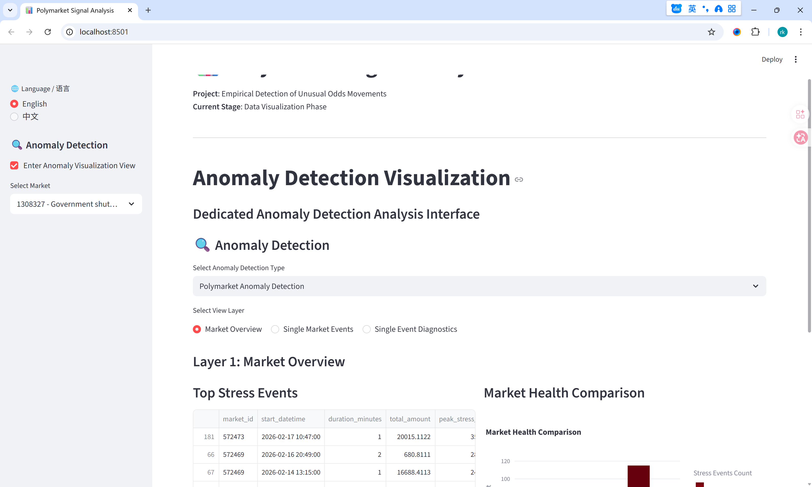

# CS6290 — Individual Evidence Pack (Milestone 3)

## Student Information

- **Name:** ZHANG Ruikun
- **Student ID (SID):** 59982716
- **Group Number / Project Title:** Group 2 / Polymarket Signal Analysis — Empirical Detection of Unusual Odds Movements
- **Milestone:** Milestone 3
- **Date:** 29/03/2026

## 1) What I Contributed

### Branch 1: Anomaly Detection Visualization Integration
  - **Three-Layer Drill-Down Interface**: Implemented a hierarchical visualization system for market stress anomaly detection with three progressive levels of detail, following the "Top-Down" design approach.
  - **Market Overview Layer**: Developed a top-level dashboard displaying cross-market stress event rankings and health comparisons using bar charts and data tables, sourcing data from market_stress_summary and all_stress_events files.
  - **Single Market Events Layer**: Created an intermediate view featuring event attribution pie charts and interactive bubble charts correlating stress scores with trading volumes, using stress_events_enriched data.
  - **Event Diagnostics Layer**: Built a detailed diagnostic panel with four synchronized subplots showing stress scores, trading activity, liquidity status, and price trends within event time windows, with 10-minute extended time range for context.

### Branch 2: Sniper Detection Frontend Showcase
  - **Card-Based UI Implementation**: Designed and implemented a "Detective Report" card-based interface for displaying sniper attack detection results with risk-level color coding (red for high risk, orange for medium, green for low).
  - **Verified Cases Display**: Created an expandable card component for showcasing three verified sniper attack cases (rank 2, 3, 4) with complete transaction details and attack window visualizations.
  - **Candidate Ranking System**: Implemented a paginated list view (5 candidates per page) for browsing sniper candidates sorted by suspicious rank, featuring anomaly score distribution histograms.
  - **Data Integration**: Integrated sniper detection datasets including detailed_cases.json, strict_sniper_candidates.csv, all_cases.json, and attack window plot images.

### Branch 3: Data Loading Infrastructure
- **Extended Data Loader Functions**: Added specialized loading functions for anomaly detection outputs including bucket features, bucket scores, market stress summaries, and stress event collections.
- **Multi-Source Data Support**: Implemented unified data access patterns for both market stress anomaly results and sniper detection outputs stored in different formats.
- **Caching Optimization**: Applied Streamlit caching decorators to all new data loading functions to maintain dashboard performance with large anomaly detection datasets.

## 2) Evidence 

| #    | Evidence type | Link / Reference                                             | What this shows                                              |
| ---- | ------------- | ------------------------------------------------------------ | ------------------------------------------------------------ |
| 1    | Repository    | https://github.com/zrk494/ProjectOfPrivacy-enhancingTech/tree/main/submodules/visualize | The central repository containing the visualization module with integrated anomaly detection interface. |
| 2    | Screenshot    | The image below                                              | Implemented three-layer drill-down anomaly detection visualization with synchronized multi-metric charts. |

- **Anomaly Detection Visualization**

## 3) Validation Performed 

- **Multi-Layer Navigation Testing**: Verified seamless transitions between the three visualization layers (market overview, single market events, event diagnostics) with consistent data state preservation.
- **Cross-Market Data Loading**: Confirmed successful loading and display of anomaly detection results across multiple market datasets with proper datetime parsing and formatting.
- **Sniper Detection Data Integration**: Validated correct parsing and display of JSON-based sniper detection results including transaction details and attack window images.
- **Visualization Component Validation**: Tested all Plotly chart components including pie charts for attribution, bubble charts for event correlation, and synchronized subplots for time-series diagnostics.
- **Pagination Functionality**: Verified the paginated display of sniper candidates with proper session state management for page navigation.
- **Bilingual Interface Testing**: Confirmed all new interface elements and labels display correctly in both English and Chinese language modes.

## 4) AI Usage Transparency

- **AI tool(s) used:** Used **DeepSeek** for researching visualization design patterns for anomaly detection dashboards. Used **Gemini** to assist in structuring the three-layer drill-down interface and refining documentation.
- **One AI output I rejected (and why it was wrong, risky, or insufficient):**
  - **Rejection**: Rejected the suggestion to use a single complex dashboard with all metrics visible simultaneously.
  - **Correction**: Adopted a progressive disclosure approach with three distinct layers to prevent information overload and improve user navigation flow.

## 5) Risk

- **Data synchronization between anomaly detection pipeline and visualization.**
  - *Detail*: Changes to output file formats in the algorithm submodule may require corresponding updates to data loader functions; established clear path conventions to mitigate this risk.
